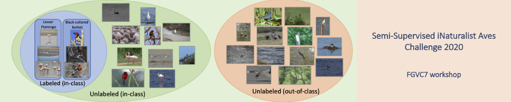
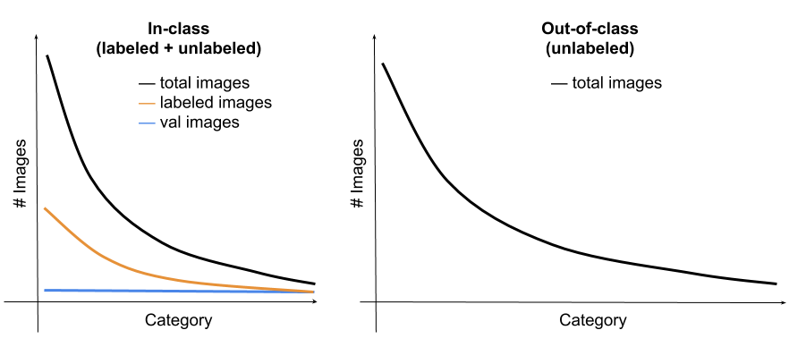
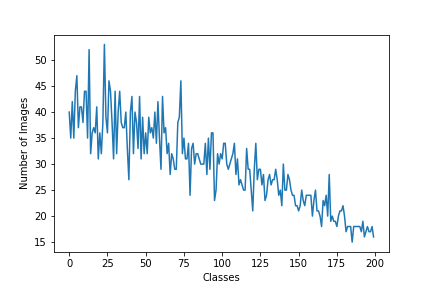
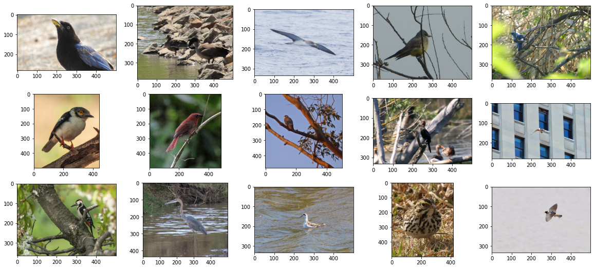
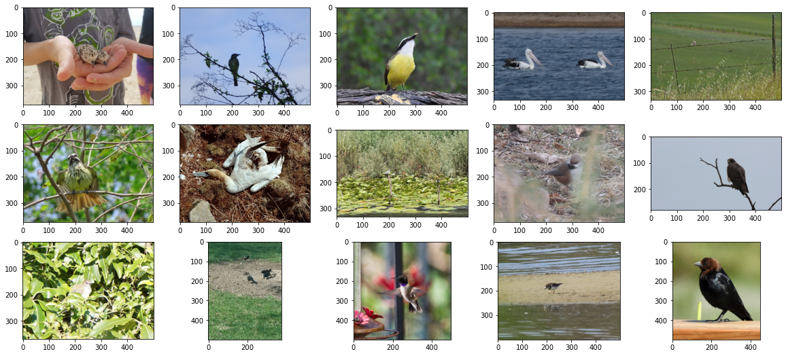
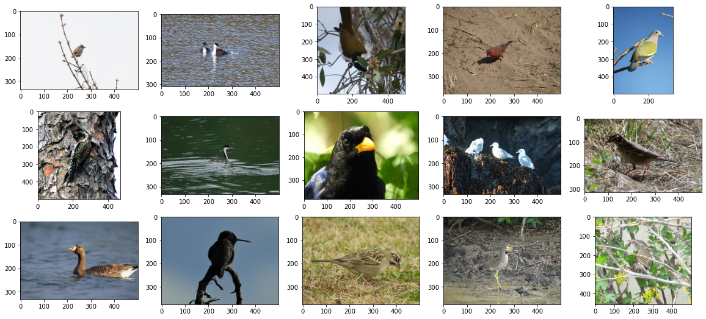
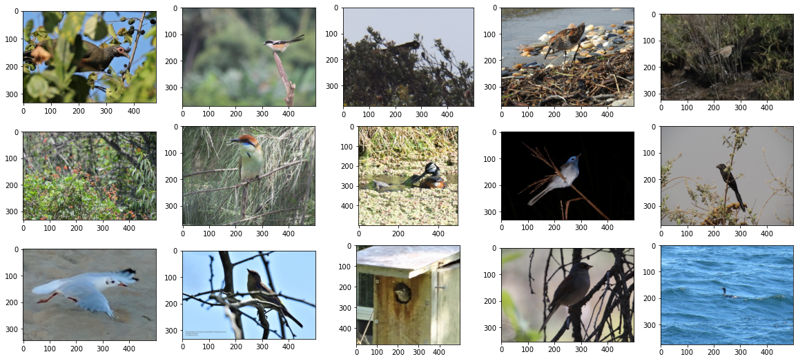

# Semi-Supervised Recognition Challenge - FGVC7
This project contains my code for the [CVPR2020](https://cvpr2020.thecvf.com/) challenge on Semi-Supervised Recognition.

- [Kaggle Challenge Link](https://www.kaggle.com/c/semi-inat-2020)
- [Github Link](https://github.com/cvl-umass/semi-inat-2020)

## Description 

A CVPR202 ML challenge focused on learning from partially labeled data, a form of semi-supervised learning. The dataset is designed to expose some challenges encountered in a realistic setting, such as the fine-grained similarity between classes, significant class imbalance, and domain mismatch between the labeled and unlabeled data.

## Overview of Approach

Primarily, I tackled the problem as transfer learning one and used best practices from 5 different domains to increase performance. 

###  Major Components of the Project

1. Transfer Learning (ImageNet --> iNat2020)
2. Fine-Grained Classification
3. Long Tail Classification 
4. Semi-supervised learning (A huge unlabelled dataset)
5. Learning From out of distribution data

## Competition Results

### Data
This challenge focuses on Aves (birds) classification, where we
provide labeled data of the target classes and unlabeled data from
target and non-target classes.
The data is obtained from iNaturalist, a community-driven project aimed at collecting biodiversity observations.

The dataset comes with standard training, validation, and test sets.
The training set consists of:

* **labeled images** from 200 species of
Aves (birds), where 10% of the images are labeled.
* **unlabeled images** from the same set of classes
as the labeled images (**in-class**).
* **unlabeled images** from a different set of classes as the
  labeled set (**out-of-class**). 
  These images are from a different set of classes in the Aves taxa.
  This reflects a common scenario where a coarser taxonomic label of
  an image can be easily obtained.
  
The validation and test set contain 10 and 20
images respectively for each of the 200 categories in the labeled set.
The distributions of these images are shown in the table below.

| Split | Details | Classes	| Images |
|:------:|:-------:|:--------:|:-------------:|
Train | Labeled | 200 |3,959|
Train | Unlabeled, in-class | 200 |26,640|
Train | Unlabeled, out-of-class | - |122,208|
Val  | Labeled | 200 | 2,000|
Test | Public | 200 |4,000|
Test | Private| 200 |4,000|

The number of images per class follows a heavy-tailed distribution as
shown in the Figure below.

### Exploring Data

#### Class Distribution

#### Train and validation

#### Test

#### In-distribution data

#### Out-distribution data

## References 
1. https://github.com/victoresque/pytorch-template
2. https://github.com/cvl-umass/semi-inat-2020

